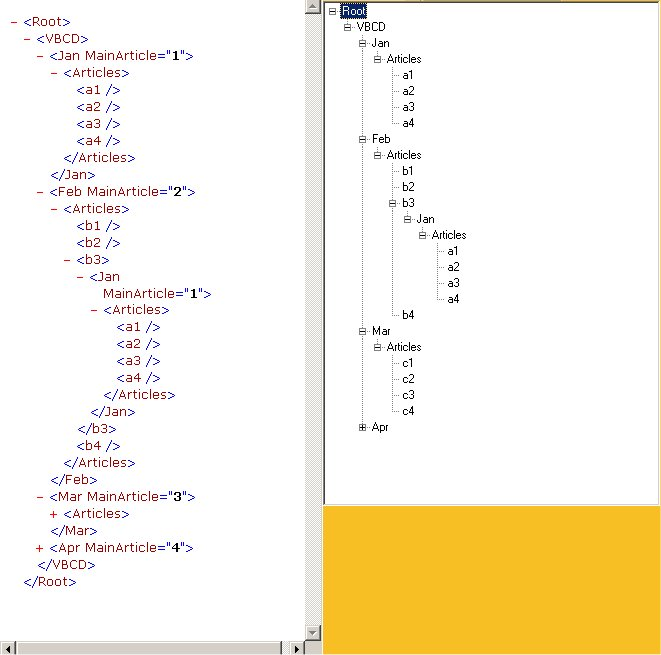



## A Dll Project That Reads XML Into a Treeview

### Description

This Code uses the Microsoft XML Parser to Read an XML Source and Put it into a treeview. Ut Can Accept A path to An XML File EX:"C:\MYxml.XML" A string EX:"'<Root><Node1/></Root>'" or a URL to an XML File Ex:"Http://www.MySite.Com/Myxml.XML"
 
### More Info
 
All you need to do is Pass the XMLTree.Plantree Class the Treeview Name and the Path to an XML Data Or some XMLData and it will do the Rest

You MUST have MSXML3 installed on your machine for this to Work

             |
---                |---
**Submitted On**   |2001-01-09 23:07:34
**By**             |[Paul Stevens](https://github.com/Planet-Source-Code/PSCIndex/blob/master/ByAuthor/paul-stevens.md)
**Level**          |Intermediate
**User Rating**    |4.3 (51 globes from 12 users)
**Compatibility**  |VB 6\.0
**Category**       |[Files/ File Controls/ Input/ Output](https://github.com/Planet-Source-Code/PSCIndex/blob/master/ByCategory/files-file-controls-input-output__1-3.md)
**World**          |[Visual Basic](https://github.com/Planet-Source-Code/PSCIndex/blob/master/ByWorld/visual-basic.md)
**Archive File**   |[CODE\_UPLOAD14546252001\.zip](https://github.com/Planet-Source-Code/paul-stevens-a-dll-project-that-reads-xml-into-a-treeview__1-14070/archive/master.zip)

